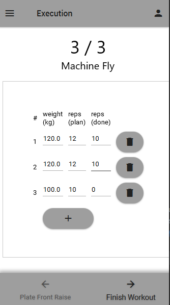

# Gym Planner
java gluon application for planning and monitoring gym exercises and progress. <br>
it was school project done as fast as possible, so it is far from "perfect".

## Database
SQL h2 database used in embedded mode <br>
 <br>
Database contains 94 different exercises activating all body parts. <br>
Exercise details comes from [weighttraining.guide](https://weighttraining.guide/category/exercises/) <br>


## Screenshots from application
### exercise database View 

### exercise details

### search view

### plan view and workout view


### workout execution 



# Gluon - Multi View using FXML

Gluon Applications are Java application written in JavaFX.
These applications ensure that developers can create high performance, great looking, and cloud connected mobile apps from a single Java code base.

This sample contains a simple Gluon application which can be used to run, test and create a native application for any targeted device.
The sample contains views represented as FXML and accessed in JavaFX using Controllers.
For more information on FXML and why to use them, checkout this [documentation](https://docs.oracle.com/javase/8/javafx/fxml-tutorial/why_use_fxml.htm).

## Pre-requisites

Please checkout the prerequisites to run this application [here](https://github.com/gluonhq/gluonfx-maven-plugin#requirements).

## Instructions

> **Note**: The following are command line instructions. For IDE specific instructions please checkout [IDE section](https://docs.gluonhq.com/#_ide) of the Gluon documenation.

These application can run on the JVM on desktop platforms. To run the application, execute the following command:

```
mvn gluonfx:run
```

The same application can also run natively for on any targeted OS, including Android, iOS, Linux, Mac and Windows.

To create a native image, execute the following command:

```
mvn gluonfx:build gluonfx:nativerun
```

> **Note**: The above commands are target-platform dependent and might change depending on the platform.
For more details, please check
    [GluonFX Maven Goals](https://github.com/gluonhq/gluonfx-maven-plugin#2-goals).

## Configuration

To configure the GluonFX plugin, please checkout the [configuration documentation](https://docs.gluonhq.com/#_configuration).

## More information

Here are some helpful links:

* [Gluon documentation](https://docs.gluonhq.com/)
* [GluonFX Maven Plugin](https://github.com/gluonhq/gluonfx-maven-plugin)
* [GluonFX Gradle Plugin](https://github.com/gluonhq/gluonfx-gradle-plugin)
